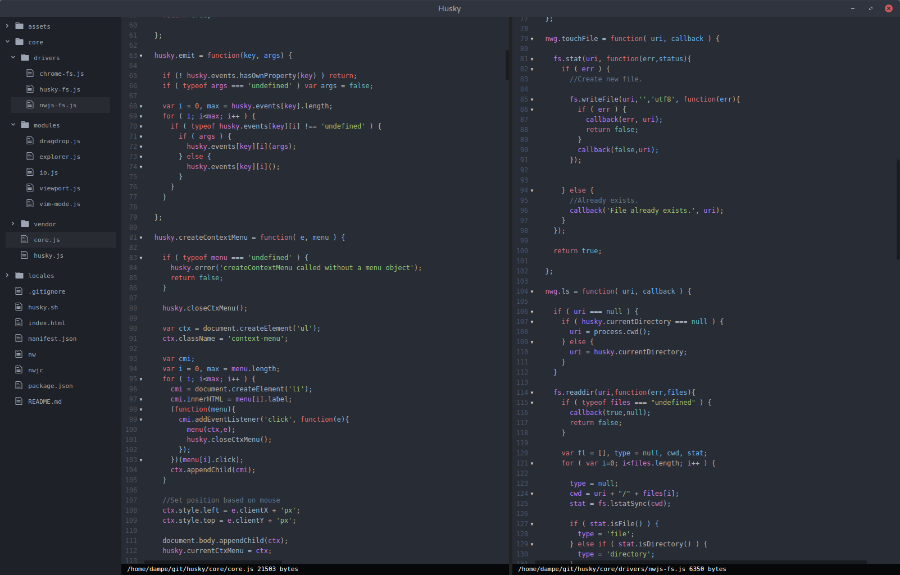

# Husky editor

Husky editor is a small code editor built upon web technologies, with the goal
of a flexible runtime environment.

Drivers can be written for common tasks such as i/o to assist with running husky
in multiple environments.

Although in early development, husky can (with work) run on

* Windows, OSX and Linux via nw.js and Electron as an application
* Modern web browsers, with a simple Node.js based file server for i/o operations
* As a Google Chrome application
* Any other environment that supports industry standard HTML5 / CSS3 / ECMAScript 5

## Planned feature list

1. Add a "buffer overview" module that shows all open buffers
2. Better documentation on extending and writing drivers and modules for husky
3. Automatic runtime detection and configuration storage
4. A form of modular "plugin" management
